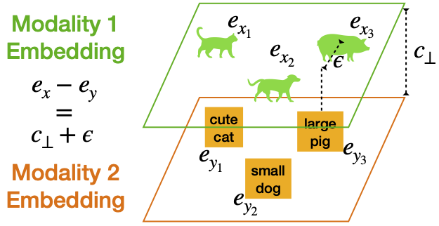

# Connect, Collapse, Corrupt: Learning Cross-Modal Tasks with Uni-Modal Data

[](https://lbesson.mit-license.org/)
[](https://www.python.org/downloads/release/python-311/)
[](https://pytorch.org/get-started/previous-versions/#v21)
[](https://github.com/ambv/black)

This repo provides the PyTorch source code of our paper: 
[Connect, Collapse, Corrupt: Learning Cross-Modal Tasks with Uni-Modal Data](https://arxiv.org/abs/2401.08567) (ICLR 2024). Check out project page [here](https://yuhui-zh15.github.io/C3-Website/)!

## 🔮 Abstract

Building cross-modal applications is challenging due to limited paired multi-modal data. Recent works have shown that leveraging a pre-trained multi-modal contrastive representation space enables cross-modal tasks to be learned from uni-modal data. This is based on the assumption that contrastive optimization makes embeddings from different modalities interchangeable. However, this assumption is under-explored due to the poorly understood geometry of the multi-modal contrastive space, where a modality gap exists. In our study, we provide a theoretical explanation of this space's geometry and introduce a three-step method, $C^3$ (Connect, Collapse, Corrupt), to bridge the modality gap, enhancing the interchangeability of embeddings. Our $C^3$ method significantly improves cross-modal learning from uni-modal data, achieving state-of-the-art results on zero-shot image / audio / video captioning and text-to-image generation.


## 💡 Approach

<p float="left">
  
   
</p>

**Figure: Overview of the motivation behind our approach, $C^3$.** Our work provides a theoretical explanation of the unique geometry that arises from multi-modal contrastive learning, where a modality gap and alignment noise exist in the learned representation space. Building upon this observation, we present a straightforward technique, $C^3$, which enhances the interchangeability of embeddings between modalities, enabling the creation of cross-modal applications using only uni-modal data.

## 🚀 Getting Started

- Reproduce embedding geometry analysis results [here](geometry_analysis/README.md).

- Reproduce image captioning results [here](image_captioning/README.md).

- Reproduce image generation results [here](image_generation/README.md).

- Reproduce ImageBind results [imagebind branch](https://github.com/yuhui-zh15/C3/tree/imagebind).

## 🎯 Citation

If you use this repo in your research, please cite it as follows:

```
@inproceedings{C3,
  title={Connect, Collapse, Corrupt: Learning Cross-Modal Tasks with Uni-Modal Data},
  author={Zhang, Yuhui and Sui, Elaine and Yeung-Levy, Serena},
  booktitle={International Conference on Learning Representations (ICLR)},
  year={2024}
}
```
